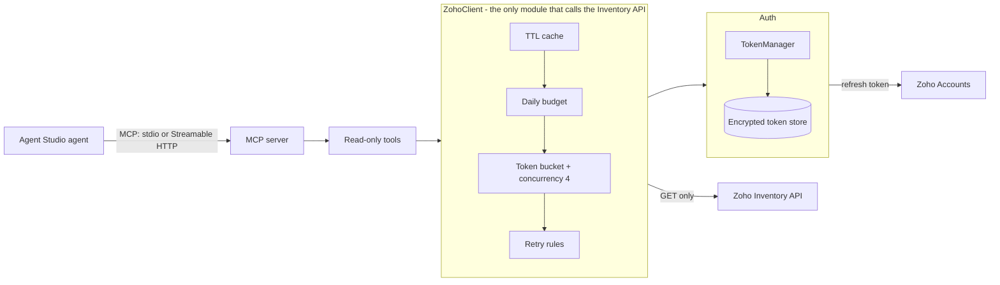
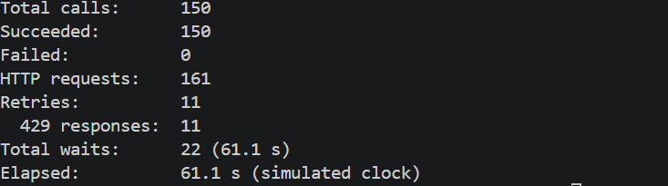

# Zoho Inventory MCP Connector

[](https://github.com/Jowan69/zoho-inventory-mcp-connector/actions/workflows/ci.yml)

A read-only MCP connector that lets an Agent Studio agent read Zoho Inventory sales orders and stock.

## Try it in 60 seconds (no Zoho account)

Demo mode serves captured fixtures from `tests/fixtures/` through the real `ZohoClient`. It makes no network calls.
You need Python 3.11+ and [uv](https://docs.astral.sh/uv/).

```bash
uv sync
```

PowerShell:

```powershell
$env:ZOHO_DEMO = "1"
uv run zoho-connector tools status
uv run zoho-connector tools search-orders SO-0001
uv run zoho-connector tools list-items --status lowstock
```

bash:

```bash
export ZOHO_DEMO=1
uv run zoho-connector tools status
uv run zoho-connector tools search-orders SO-0001
uv run zoho-connector tools list-items --status lowstock
```

Browse the tools in the [MCP Inspector](https://github.com/modelcontextprotocol/inspector) (needs Node.js; `ZOHO_DEMO=1` must be set in the same shell):

```bash
npx @modelcontextprotocol/inspector uv run zoho-connector serve
```


Or run the Streamable HTTP transport on `http://127.0.0.1:8000/mcp`:

```bash
uv run zoho-connector serve --transport http
```

## Connect to a live Zoho account

1. **Create a client.** In the [Zoho API Console](https://api-console.zoho.com) (use the console for your data centre), create a *Server-based Application*. Set its authorized redirect URI to the same value configured in `ZOHO_REDIRECT_URI` (default: `http://localhost:8765/callback`). Note the client ID and secret.
2. **Configure `.env`.** Copy `.env.example` to `.env` and fill it in:

   | Variable | Meaning |
   |---|---|
   | `ZOHO_CLIENT_ID`, `ZOHO_CLIENT_SECRET` | From the API Console. |
   | `ZOHO_DC` | Data centre suffix: `com` (default), `eu`, `in`, `com.au`, `jp`, `ca`, `sa`, `com.cn`. Must match your Zoho account. |
   | `ZOHO_REDIRECT_URI` | Default `http://localhost:8765/callback`; must match the API Console. |
   | `TOKEN_ENCRYPTION_KEY` | Fernet key: `uv run python -c "from cryptography.fernet import Fernet; print(Fernet.generate_key().decode())"` |
   | `ZOHO_ORG_ID` | Optional. Overrides the organization chosen at login. |
   | `DAILY_BUDGET` | Optional. Requests per UTC day, default `900`. |
   | `MCP_SERVER_TOKEN` | Optional. Bearer token required on the HTTP transport. |
   | `ZOHO_DEMO` | `1` serves fixtures instead of calling Zoho. |

3. **Log in.** `uv run zoho-connector auth login` opens the browser, runs the consent flow and stores the encrypted refresh token in `tokens/`.
4. **Check.** `uv run zoho-connector auth status` shows data centre, organization and whether a token refresh works. `uv run zoho-connector debug ping` makes one real API call.
5. **Serve.** `uv run zoho-connector serve` (stdio, the default) or `uv run zoho-connector serve --transport http --host 127.0.0.1 --port 8000`.

`auth logout` revokes the refresh token at Zoho and deletes the local store (`--force` clears it even if the revoke fails).

## Architecture



Tools validate input and map raw Zoho JSON to small output models. Only `auth/oauth.py` talks to Zoho Accounts. An architecture test (`tests/test_architecture.py`) checks that only `ZohoClient` issues Inventory requests and that they are all GET.

## Tools

Seven tools, all annotated `readOnlyHint`. The full schemas are in [`tools.json`](tools.json), generated with `uv run zoho-connector export-tools`.

| Tool | Type | Key inputs | Returns |
|---|---|---|---|
| `list_sales_orders` | list | `status`, `date_from`, `date_to` (YYYY-MM-DD), `page`, `per_page` | Page of order summaries |
| `get_sales_order` | get | `salesorder_id` (digits) | Order with line items; contact email and phone masked |
| `search_sales_orders` | search | `query` (2+ chars: order no., reference or customer), `status`, `page`, `per_page` | Page of order summaries |
| `list_items` | list | `status` (`active`, `inactive`, `all`, `lowstock`), `page`, `per_page` | Page of item summaries with stock |
| `get_item` | get | `item_id` (digits) | Item with reorder level and stock per location |
| `search_items` | search | `query` (2+ chars: name or SKU), `page`, `per_page` | Page of item summaries |
| `connector_status` | status | none | Mode (live/demo), login state, organization, requests used today and budget. Makes no Zoho call. |

Lists return `{results, next_page, warning}`. `per_page` is 1 to 100 (default 25). `next_page` is null on the last page. `warning` appears once 80% of the daily budget is used.

## Authentication

- OAuth 2.0 authorization-code flow with `access_type=offline` and `prompt=consent`, so Zoho returns a refresh token.
- The login callback checks the `state` value (constant-time compare) before accepting the code. The accounts server in the redirect is only trusted if it is a known Zoho host.
- Scopes are read-only: `ZohoInventory.items.READ`, `ZohoInventory.salesorders.READ`, `ZohoInventory.settings.READ`.
- `TokenManager` refreshes the access token 5 minutes before expiry. Concurrent callers share one refresh (single-flight, behind a lock).
- The refresh token is stored Fernet-encrypted in `tokens/`. The key comes from `TOKEN_ENCRYPTION_KEY`.
- On HTTP 401 the client invalidates the rejected token, refreshes once and retries once.

## Rate limits

Zoho's free plan allows 100 requests/min, 1000/day and 5 concurrent per organization. The connector stays under that with four layers, all in `ZohoClient`:

1. **Cache.** Successful GET responses are cached for 60 s; item detail (`get_item`) for 300 s. Errors are never cached. At most 512 entries.
2. **Daily budget.** `DAILY_BUDGET` (default 900) requests per UTC day, counted in `tokens/usage.json` so it survives restarts. A warning is logged and returned in list results at 80%. When spent, calls fail with `DAILY_QUOTA_EXHAUSTED` without contacting Zoho.
3. **Token bucket and concurrency.** 90 requests/min (continuous refill, FIFO) and at most 4 requests in flight.
4. **Retry rules.**

   | Response | Behaviour |
   |---|---|
   | 429, code 44 (per minute) | Wait `Retry-After` (capped at 60 s), else `min(2**attempt, 30)` s + 0 to 1 s jitter. Up to 3 retries, then `RATE_LIMITED`. |
   | 429, code 45 (daily) | No retry. `DAILY_QUOTA_EXHAUSTED`. |
   | 5xx or network error | One retry after 2 s, then `UPSTREAM_ERROR`. |
   | 401 | Refresh the token once, retry once, then `AUTH_REQUIRED`. |

   Every retry goes through the bucket again and counts against the budget.

Load test (`uv run python scripts/load_test.py`): 150 calls with the cache off against a local mock that returns 429 above 100 requests/min, on a simulated clock.



All 150 calls succeeded. They took 161 HTTP requests: 11 were 429s that the client retried. Simulated elapsed time was 61.1 s. `--live` runs the same test against real Zoho. It attempts 150 calls; actual API usage can be higher if retries occur.

## Errors

Failures are returned as a tool result with `isError` and a JSON body: `{code, message, retryable, agent_action}`. Messages are redacted and capped at 300 characters.

| Code | Meaning | `agent_action` |
|---|---|---|
| `NOT_FOUND` | The ID does not exist. | Ask the user to check the ID or use a search tool. |
| `INVALID_INPUT` | Bad arguments (short query, bad date, non-numeric ID, `per_page` over 100). | Fix the arguments as the message says, then call again. |
| `RATE_LIMITED` | Zoho kept returning per-minute 429s after 3 retries. | Wait about a minute, then retry once. |
| `DAILY_QUOTA_EXHAUSTED` | The connector budget or Zoho's daily limit is used up. | Stop. Tell the user the daily limit is used. |
| `AUTH_REQUIRED` | Not logged in, or Zoho rejected the token after a refresh. | Stop. Tell the user an admin must run auth login. |
| `UPSTREAM_ERROR` | Zoho 5xx, network failure or an unexpected response. | Retry once later. If it fails again, tell the user Zoho is failing. |

## Testing

```bash
uv run pytest -q
uv run ruff check .
```

215 tests pass and ruff is clean (run 2026-10-06). Total coverage is 88%, measured with `uv run pytest -q --cov=zoho_connector`; `cli.py` is the weakest at 44%. Tests use `respx` and the demo transport, so they need no network or credentials. CI (`.github/workflows/ci.yml`) runs ruff and pytest with `ZOHO_DEMO=1` on every push and pull request.

## Agent evaluation

[`docs/agent-eval.md`](docs/agent-eval.md) contains 10 test questions with the expected tool for each, including a write request the agent must refuse.

Agent evaluation has not yet been run. MCP protocol and tool exposure were validated separately with MCP Inspector.

## Security

- **No secrets in logs.** A redacting filter scrubs Zoho tokens and the client secret, including httpx's own request log. `tests/test_log_safety.py` runs login, refresh, tool calls and failures and checks that no secret appears in the logs.
- **PII masking.** Customer emails are masked (`j***@example.com`) and phones keep only the last 4 digits.
- **Free text excluded.** Notes, terms and descriptions are not in the output models, so they never reach the agent.
- **HTTP transport.** Set `MCP_SERVER_TOKEN` to require `Authorization: Bearer <token>`. The server binds to `127.0.0.1` by default and warns if you bind elsewhere without a token.
- **Secrets at rest.** `.env` and `tokens/` are git-ignored. The refresh token is encrypted. Secrets are `SecretStr` in settings.
- **Read only.** Read-only scopes, GET only, no write tools.

## Limitations

See [docs/CAPABILITIES.md](docs/CAPABILITIES.md). Design decisions are in [docs/DESIGN.md](docs/DESIGN.md).
